  

  
  
  <!-- Optional: add your CGPA -->
  <!--  -->
  

  
  <!-- TODO: replace YOUR-HANDLE with your LinkedIn username -->
  
  
  
  <!-- Optional extras: Portfolio, LeetCode, Kaggle -->
  <!--  -->

---

## About

Computer Science Engineering student at Bennett University and software developer.

**Currently:** seeking software development internships.

---

## Live Systems

Automated pipelines running on GitHub Actions.

| System | Schedule | Status |
| :-- | :-- | :-- |
| [Intraday bot](https://github.com/HRaj07/algo-intraday) | Every 15 min, market hours |  |
| [Swing portfolio](https://github.com/HRaj07/algo-trading) | Daily, after NSE close |  |

---

## Engineering Approach

**Evidence-based decisions.** Strategies are deployed only after validation through multi-year backtests. 
**Financial correctness.** Idempotent transactions and balanced double-entry accounting. 
**Security by default.** Token rotation, rate limiting and input validation on every API.

---

## Technical Skills

| | |
| :-- | :-- |
| **Languages** |  |
| **Frontend** |  |
| **Backend & Data** |  |
| **Machine Learning** |  |
| **Cloud & DevOps** |  |

  
  
  
  
  
  
  
  
  

---

## GitHub Statistics

  
  

  

  <picture>
    <source media="(prefers-color-scheme: dark)" srcset="https://raw.githubusercontent.com/HRaj07/HRaj07/output/github-snake-dark.svg" />
    <source media="(prefers-color-scheme: light)" srcset="https://raw.githubusercontent.com/HRaj07/HRaj07/output/github-snake.svg" />
    
  </picture>

<!--
## Experience
Uncomment and fill in when you have internships or roles to show.

**Role · Company** · Month YYYY to Present · Remote / City
One sentence on what the team does and what you owned.
- What you built, with a number (users, latency, time saved)
- What changed because of it

## Achievements and certifications
| Recognition | Details |
| :-- | :-- |
| Hackathon / competition | Organiser, year, result |
| Certification | Issuer, year, credential ID |
-->

---

  Trading systems operate in paper-trading mode for research purposes and do not constitute financial advice.

